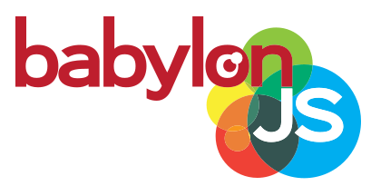
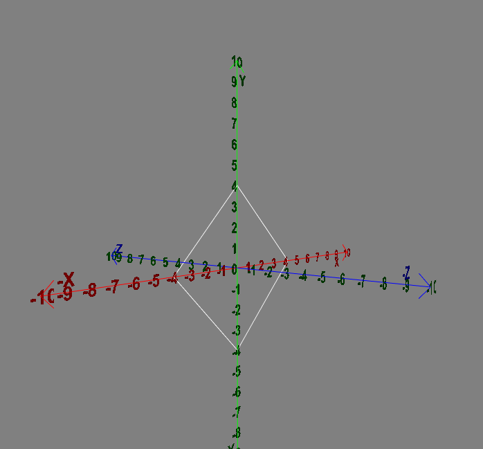

# BabylonJS Tutorial Series–Getting Started

<p align="center"></p>


> Babylon.js is a JavaScript API for building and rendering 3D games within a browser, using HTML5, WebGL, WebVR and Web Audio. In this Babylon.js Tutorial, we provide an introduction to Babylon.js and the Javascript API it is based on, WebGL. We then showcase a code demo where we walk through the steps of creating a 3D object, setting the scene's lights, cameras, meshes, and materials. 

`BabyloJS/frame.html#VPS540`

<p align="center"></p>

## The options for using BabylonJS include:

- https://cdn.babylonjs.com/babylon.js
- http://cdn.babylonjs.com/2-4/babylon.max.js
- http://cdn.babylonjs.com/2-4/babylon.noworker.js
- http://cdn.babylonjs.com/2-4/babylon.core.js

## GITHUB
```
git clone https://github.com/BabylonJS/Babylon.js.git
go to cd BabylonJS/
npm install
```

`npm install babylonjs --save`

## Links
- https://gamefromscratch.com/babylonjs-tutorial-series-getting-started/
- https://www.tutorialspoint.com/babylonjs/babylonjs_environment_setup.htm
- https://github.com/BabylonJS/CDN

- Renato Lucena - 12/2020